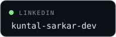
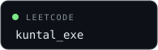
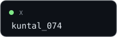
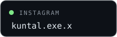

# `>_ Hello, World! 👋`

  

 

  

### CSE Student • Aspiring Software Developer

`C/C++` &nbsp; `Python` &nbsp; `DSA` &nbsp; `JavaScript` &nbsp; `React`

`SQL` &nbsp; `Web Development` &nbsp; `Cybersecurity`

---

## `01` — About Me

---

## `02` — Current Mission

<table>
<tr>

<td width="50%" valign="top">

### ⚡ Vajra

Building an AI-powered robotics project focused on autonomous movement, real-time perception and practical real-world applications.

</td>

<td width="50%" valign="top">

### 🧠 DSA

Strengthening problem-solving skills through C++, data structures, algorithms and regular practice.

</td>

</tr>
</table>

 

`BUILD` • `LEARN` • `PRACTICE` • `EXPLORE`

---

## `03` — Currently Loading...

---

## `04` — GitHub Analytics

---

## `05` — Tech Arsenal

### Languages

### Web & Backend

### Databases & Developer Tools

### Other Technologies

---

## `06` — Connect

<table>
<tr>

<td>

</td>

<td>

</td>

<td>

</td>

<td>

</td>

</tr>
</table>

---

  

<code>BUILD</code>
&nbsp; • &nbsp;
<code>LEARN</code>
&nbsp; • &nbsp;
<code>BREAK</code>
&nbsp; • &nbsp;
<code>FIX</code>

  

<strong>Thanks for visiting my profile. 🚀</strong>

  

